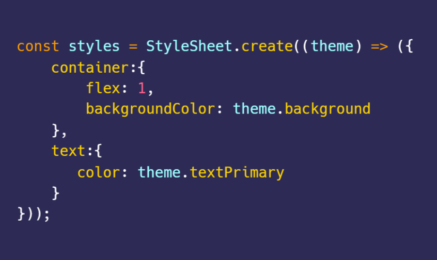

# React Native Sugar Style
Theme based alternative for React Native StyleSheet. (🧪 Experimental)

Before:


After:



#### Install
```
yarn add react-native-sugar-style
```
```
npm i react-native-sugar-style
```

#### Setup
**style.tsx** - define a configuration for you theme
```javascript
import  {Sugar, constants} from 'react-native-sugar-style'

const theme = {
    ...constants,
    background: "#fbfbfb",
    text: "#2b2b2b"
}

type Theme = typeof theme;
const StyleSheet = new Sugar<Theme>(theme);

export default StyleSheet;
```
**component.tsx** - use StyleSheet as you do normally
```javascript

import React from 'react';
import {View, Text} from 'react-native';
import StyleSheet from './style';

const Component = () => (
  <View style={styles.container}>
    <Text style={styles.text}>Hello World</Text>
  </View>
)

const styles = StyleSheet.create((theme) => ({
  container: {
    height: theme.constant.height,
    width: theme.constant.width,
    backgroundColor: theme.background,
  },
  text: {
    fontSize: theme.font.size,
    color: theme.text
  }
}))


```

#### TODO

- add orientation support
- refactor types for named styles
- stop re-rendering when same theme is applied again
- caching stylesheets
- add device pixel ratio to constant


#### Acknowledgement

Special thanks to the Authors of the amazing open source libraries

[React Native Extended Stylesheet](https://github.com/vitalets/react-native-extended-stylesheet)
